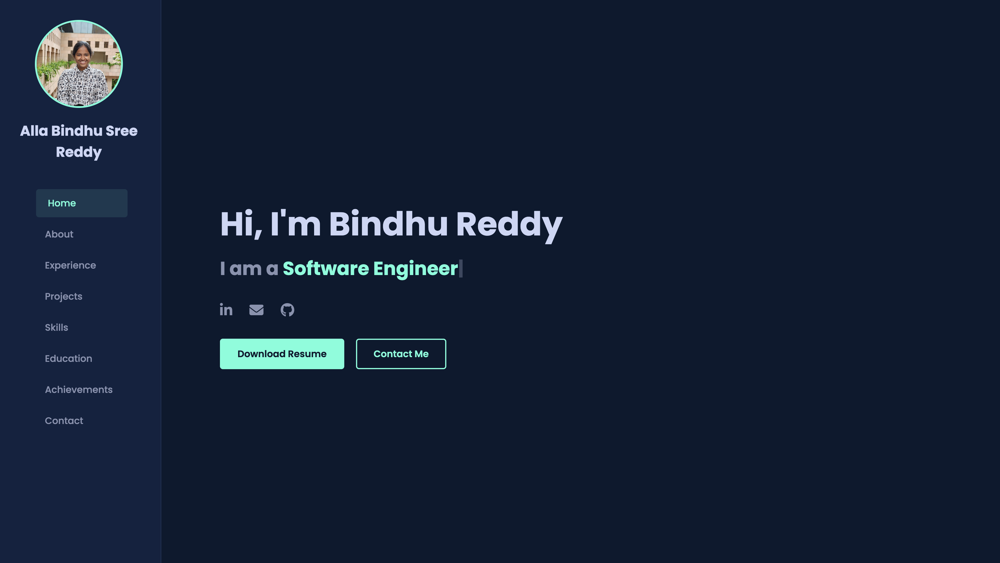

# Alla Bindhu Sree Reddy - Personal Portfolio

Welcome to the source code for my personal portfolio website. This project is a responsive, single-page application designed to showcase my skills, professional experience, and the projects I've worked on. It's built with clean HTML, modern CSS, and dynamic JavaScript to create an engaging user experience.

---

###  📸 Screenshot



---

###  ✨ Features

* **Interactive Hero Section:** An engaging introduction with a dynamic `Typed.js` animation.
* **Smooth Scrolling:** Seamless navigation between sections powered by GSAP's ScrollToPlugin.
* **Dynamic Animations:** Subtle, scroll-triggered fade-in and slide-in effects for a professional feel.
* **Responsive Design:** A fully responsive layout that looks great on desktops, tablets, and mobile devices.
* **Comprehensive Sections:** Detailed sections for my professional experience, personal projects, skills, education, and achievements.

---

###  🛠️ Tech Stack

This project was built using modern web technologies and libraries:

* **Frontend:**
    * HTML5
    * CSS3 (Flexbox, Grid)
    * JavaScript (ES6)

* **Libraries:**
    * [**GSAP (GreenSock)**](https://greensock.com/gsap/): Used for high-performance animations, including smooth scrolling and scroll-triggered effects.
    * [**Typed.js**](https://github.com/mattboldt/typed.js/): Powers the typing animation in the home section.
    * [**Font Awesome**](https://fontawesome.com/): Provides the high-quality icons used throughout the site.

---

###  🚀 Getting Started

This is a static website, so no complex setup is required to run it locally.

**Prerequisites:**
* A modern web browser (e.g., Chrome, Firefox, Safari).
* A code editor like VS Code (optional, for development).

**Installation & Setup:**

1.  **Clone the repository:**
    ```bash
    git clone [https://github.com/bindhusreereddy/your-portfolio-repo.git](https://github.com/bindhusreereddy/your-portfolio-repo.git)
    ```
    *(Replace `your-portfolio-repo` with your actual repository name)*

2.  **Navigate to the project directory:**
    ```bash
    cd your-portfolio-repo
    ```

3.  **Open in your browser:**
    Simply open the `index.html` file directly in your web browser to view the portfolio.

    For the best development experience, I recommend using the **Live Server** extension in Visual Studio Code, which provides live reloading.
